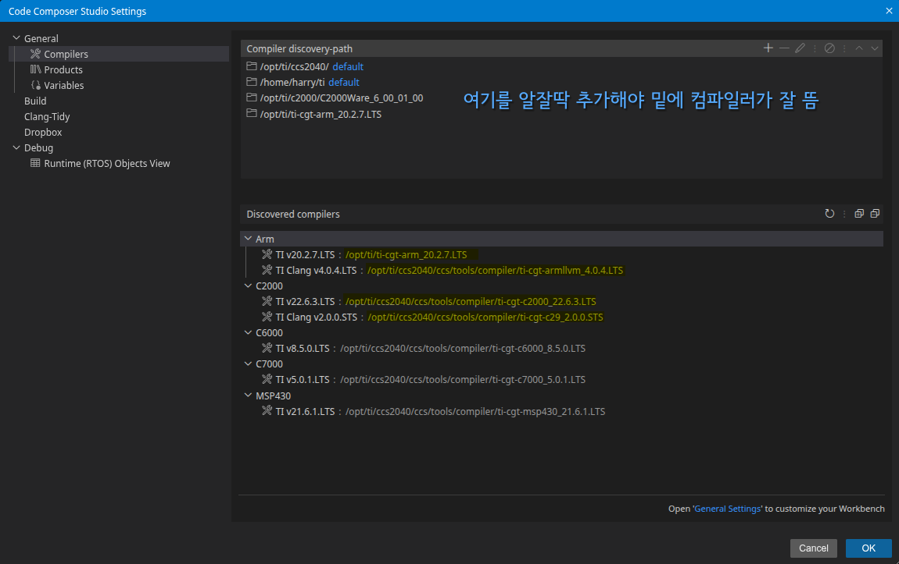

# PEETS_Standard_V3

이 저장소의 F28388D 표준 예제를 위한 TI C2000 CCS 워크스페이스입니다.

## 프로젝트
- `peets_standard_v3_c28_cpu1` (CPU1)
- `peets_standard_v3_c28_cpu2` (CPU2)
- `peets_standard_v3_arm_cm` (CM)

## 레이아웃
각 프로젝트 루트에 소스와 설정 파일이 위치합니다.
링커 커맨드 파일(`*.cmd`)은 각 프로젝트 루트에 둡니다.

## 빌드 (CCS)
1. Code Composer Studio 20.4.0 이상 설치 (ccs2040 레이아웃 기준).
2. C2000Ware 설치 (`C2000Ware_6_00_01_00` 기준).
3. TI CGT C2000 컴파일러 v22.6.3 LTS 이상 사용 (CPU1/CPU2).
4. TI CGT ARM (TMS470) 컴파일러 v20.2 LTS 사용 (CM).
5. CCS 워크스페이스에 세 프로젝트를 Import.
6. 원하는 구성으로 빌드 (`CPU1_RAM`, `CPU2_RAM`, `CM_RAM` 등).

이 워크스페이스에서 사용하는 기본 설치 경로:
- CCS: `/opt/ti/ccs2040`
- C2000Ware: `/opt/ti/c2000/C2000Ware_6_00_01_00`
- TI CGT C2000 컴파일러: `/opt/ti/ccs2040/ccs/tools/compiler/ti-cgt-c2000_22.6.3.LTS/bin/cl2000`
- TI CGT ARM 컴파일러: `/opt/ti/ccs2040/ccs/tools/compiler/ti-cgt-arm_20.2.x.LTS/bin/armcl`

Windows 기본 설치 경로(태스크 기준):
- CCS: `C:\\ti\\ccs2040`
- C2000Ware: `C:\\ti\\c2000\\C2000Ware_6_00_01_00`
- TI CGT C2000 컴파일러: `C:\\ti\\ccs2040\\ccs\\tools\\compiler\\ti-cgt-c2000_22.6.3.LTS\\bin\\cl2000.exe`
- TI CGT ARM 컴파일러: `C:\\ti\\ccs2040\\ccs\\tools\\compiler\\ti-cgt-arm_20.2.x.LTS\\bin\\armcl.exe`

## IntelliSense/clangd
CCS는 빌드 후 `CPU*_RAM/.clangd/` 와 `CM_RAM/.clangd/` 아래에
`compile_commands.json`을 생성합니다. 에디터에서 해당 파일을 지정하면
include 경로와 define을 올바르게 인식합니다.

## 스크린샷
CCS에서 가져온 워크스페이스 구성 예시입니다.

