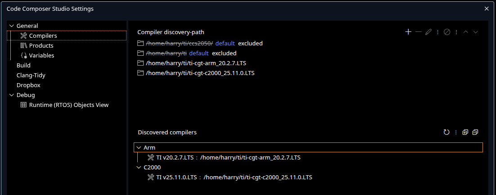
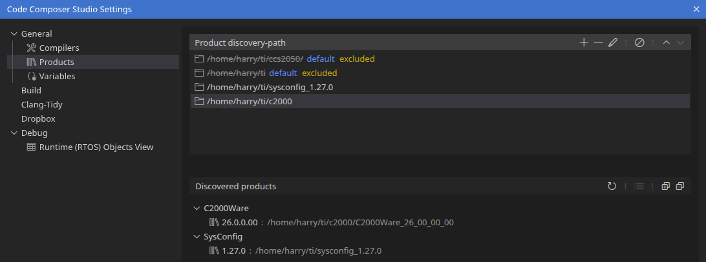
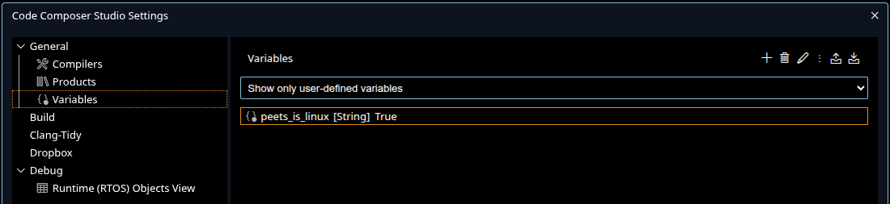
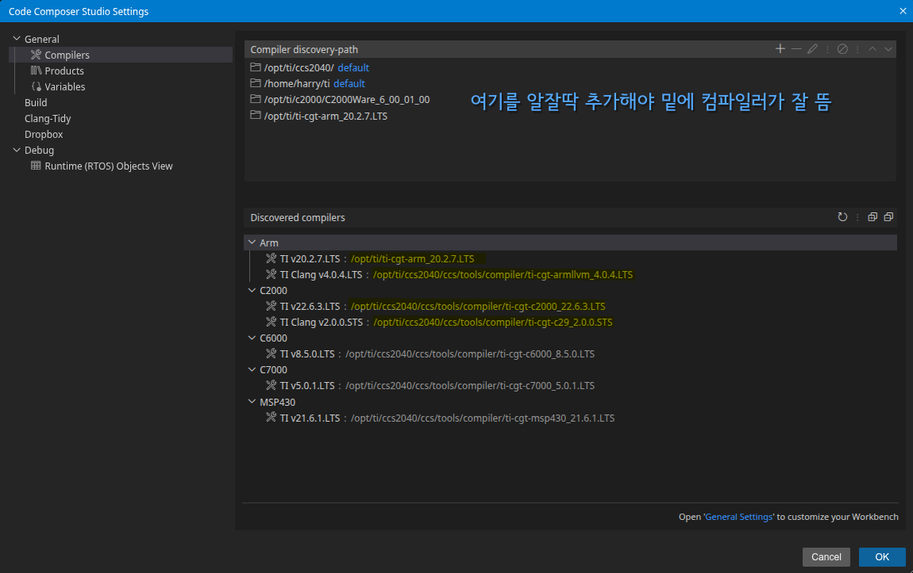

# PEETS_Standard_V3

이 저장소의 F28388D 표준 예제를 위한 TI C2000 CCS 워크스페이스입니다.

## 프로젝트
- `peets_standard_v3_c28_cpu1` (CPU1)
- `peets_standard_v3_c28_cpu2` (CPU2)
- `peets_standard_v3_arm_cm` (CM)

## 권장 역할 분담 (F28388D)
F28388D는 C28x 듀얼 코어(CPU1/CPU2) + Cortex-M4F(CM) 구조입니다. 이 워크스페이스에서는 아래처럼 역할을 나누는 구성을 권장합니다.
- CM: Ethernet/CAN/USB 등 통신 스택, 게이트웨이, 진단/로그/업데이트 등(비실시간·복잡도 높은 작업)
- CPU1: 시스템 마스터(부팅/클럭/메모리/주변장치 초기화), 전체 상태머신, 메인 루프, IPC 라우팅(필요 시 통신 포함)
- CPU2: 타이밍 민감 제어(빠른 ISR), EPWM/ECAP/ADC 트리거 기반 제어 루프 등(지터 최소화)

실제 주변장치(EPWM/ECAP 등) 소유권은 `CPUSEL` 설정과 프로젝트 구성에 따라 달라질 수 있습니다.

## 레이아웃
각 프로젝트 루트에 소스와 설정 파일이 위치합니다.
링커 커맨드 파일(`*.cmd`)은 각 프로젝트 루트에 둡니다.

## 문서
TI 관련 참고 자료와 프로젝트 메모는 `docs/ti/`에 정리되어 있습니다. (`docs/ti/그외문서들.md` 참고)
기능별 spec 문서는 `docs/specs/`에 정리합니다. 첫 파일럿은 `docs/specs/001-cpu1-cm-handshake/`입니다.

## 빌드 (CCS)
1. Code Composer Studio `20.5.0` 설치 (`ccs2050` 레이아웃 기준).
2. SysConfig는 `sysconfig_1_27_0` 기준으로 사용한다.
3. C2000Ware는 `C2000Ware26_0_0_0STS` 기준으로 사용한다.
4. TI CGT C2000 컴파일러는 `TI_CGT_C2000_25_11_0LTS`를 사용한다 (CPU1/CPU2).
5. TI CGT ARM 컴파일러는 `TI_CGT_ARM_20_2_7LTS`를 사용한다 (CM).
6. CCS 워크스페이스에 세 프로젝트를 Import.
7. 원하는 구성으로 빌드 (`CPU1_RAM`, `CPU2_RAM`, `CM_RAM` 등).

툴 역할 요약:
- `CCS`: 프로젝트 import, build, debug를 담당하는 TI 통합 개발 환경이다.
- `SysConfig`: pinmux, peripheral 설정, 초기화 코드 생성을 돕는 TI 설정 도구다.
- `C2000Ware`: F28388D용 driverlib, device header, example을 포함한 TI SDK 묶음이다.
- `TI CGT C2000`: `CPU1`/`CPU2`용 C28x 컴파일러와 링커다.
- `TI CGT ARM`: `CM`용 ARM 컴파일러와 링커다.

이 워크스페이스는 CCS의 의존성 자동 탐색에 맡기지 않고, `General > Compilers`, `General > Products`, `General > Variables`를 수동으로 맞추는 것을 기준으로 한다.
상세 절차와 스크린샷은 [docs/ti/ccs-manual-setup.md](/home/harry/Projects/CppProjects/CcsWorkspaces/PEETS_Standard_V3/docs/ti/ccs-manual-setup.md)를 참고한다.

공식 다운로드 링크:
- [Code Composer Studio Downloads](https://www.ti.com/tool/CCSTUDIO#downloads)
- [C2000Ware Downloads](https://www.ti.com/tool/C2000WARE#downloads)
- [ARM CGT Downloads](https://www.ti.com/tool/ARM-CGT#downloads)
- [C2000 CGT Downloads](https://www.ti.com/tool/C2000-CGT#downloads)

현재 Linux 설치 경로:
- CCS: `/home/harry/ti/ccs2050`
- SysConfig: `/home/harry/ti/sysconfig_1.27.0`
- C2000Ware: `/home/harry/ti/c2000/C2000Ware_26_00_00_00`
- TI CGT C2000 컴파일러: `/home/harry/ti/ti-cgt-c2000_25.11.0.LTS/bin/cl2000`
- TI CGT ARM 컴파일러: `/home/harry/ti/ti-cgt-arm_20.2.7.LTS/bin/armcl`

Windows 설치 경로는 현재 문서 작성 환경에서 검증하지 않았고, 아래는 예시다:
- CCS: `C:\\ti\\ccs2050`
- SysConfig: `C:\\ti\\ccs2050\\ccs\\utils\\sysconfig_1.27.0`
- C2000Ware: `C:\\ti\\c2000\\C2000Ware26_0_0_0STS`
- TI CGT C2000 컴파일러: `C:\\ti\\ccs2050\\ccs\\tools\\compiler\\TI_CGT_C2000_25_11_0LTS\\bin\\cl2000.exe`
- TI CGT ARM 컴파일러: `C:\\ti\\ccs2050\\ccs\\tools\\compiler\\TI_CGT_ARM_20_2_7LTS\\bin\\armcl.exe`

## IntelliSense/clangd
CCS는 빌드 후 `CPU*_RAM/.clangd/` 와 `CM_RAM/.clangd/` 아래에
`compile_commands.json`을 생성합니다. 에디터에서 해당 파일을 지정하면
include 경로와 define을 올바르게 인식합니다.

## CCS 수동 설정
이 워크스페이스는 CCS 기본 자동 탐색 결과를 그대로 신뢰하지 않는다.
컴파일러와 제품 등록은 수동 discovery-path 기준으로 고정하고, 필요한 경우 기본 경로는 `excluded` 처리한다.

- 상세 절차: [docs/ti/ccs-manual-setup.md](/home/harry/Projects/CppProjects/CcsWorkspaces/PEETS_Standard_V3/docs/ti/ccs-manual-setup.md)
- 기준 스크린샷:

## 스크린샷
CCS에서 가져온 워크스페이스 구성 예시입니다.

