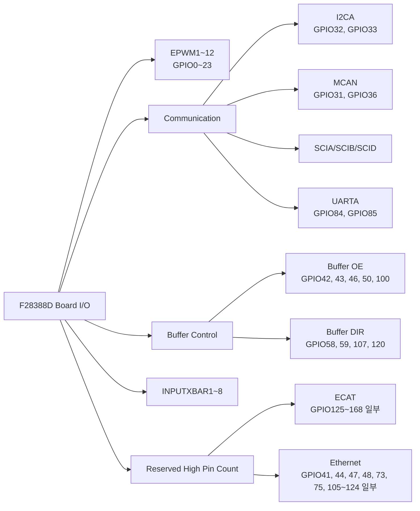
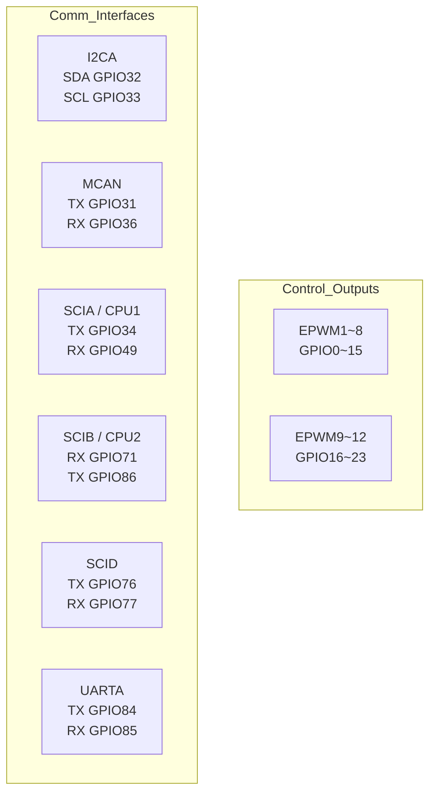

# PEETS Standard V3 Board I/O Reference

기준 자료: `sysconfig/PinmuxConfigSummary.csv`, `sysconfig/pinmux.h`, `sysconfig/핀설정에대해.md`

## 개요

- 이 문서는 현재 `sysconfig` 스냅샷 기준으로 보드의 GPIO/주변장치 매핑을 빠르게 확인하기 위한 레퍼런스다.
- 핀 변경이 필요하면 먼저 `sysconfig/PinmuxConfigSummary.csv`와 `sysconfig/pinmux.h`를 확인한다.
- 기존 메모와 충돌하는 내용이 있으면 SysConfig 결과를 우선한다.
- ECAT/Ethernet처럼 보드 배선과 강하게 묶인 기능은 임의로 재할당하지 않는다.

## 고정/예약 기능

### ECAT

- EtherCAT 관련 핀은 점유 범위가 크고, 기존 메모 기준으로도 보드 배선 변경 여지가 거의 없다.
- 아래 핀은 `MyECAT1`로 예약되어 있으므로 bring-up 근거 없이 재할당하지 않는다.

| GPIO    | Interface | Signal               | 비고      |
| ------- | --------- | -------------------- | ------- |
| GPIO125 | ECAT      | ESC_LATCH0           | MyECAT1 |
| GPIO126 | ECAT      | ESC_LATCH1           | MyECAT1 |
| GPIO127 | ECAT      | ESC_SYNC0            | MyECAT1 |
| GPIO128 | ECAT      | ESC_SYNC1            | MyECAT1 |
| GPIO129 | ECAT      | ESC_TX1_ENA          | MyECAT1 |
| GPIO130 | ECAT      | ESC_TX1_CLK          | MyECAT1 |
| GPIO131 | ECAT      | ESC_TX1_DATA0        | MyECAT1 |
| GPIO132 | ECAT      | ESC_TX1_DATA1        | MyECAT1 |
| GPIO134 | ECAT      | ESC_TX1_DATA2        | MyECAT1 |
| GPIO135 | ECAT      | ESC_TX1_DATA3        | MyECAT1 |
| GPIO136 | ECAT      | ESC_RX1_DV           | MyECAT1 |
| GPIO137 | ECAT      | ESC_RX1_CLK          | MyECAT1 |
| GPIO138 | ECAT      | ESC_RX1_ERR          | MyECAT1 |
| GPIO139 | ECAT      | ESC_RX1_DATA0        | MyECAT1 |
| GPIO140 | ECAT      | ESC_RX1_DATA1        | MyECAT1 |
| GPIO141 | ECAT      | ESC_RX1_DATA2        | MyECAT1 |
| GPIO142 | ECAT      | ESC_RX1_DATA3        | MyECAT1 |
| GPIO143 | ECAT      | ESC_LED_LINK0_ACTIVE | MyECAT1 |
| GPIO144 | ECAT      | ESC_LED_LINK1_ACTIVE | MyECAT1 |
| GPIO145 | ECAT      | ESC_LED_ERR          | MyECAT1 |
| GPIO146 | ECAT      | ESC_LED_RUN          | MyECAT1 |
| GPIO147 | ECAT      | ESC_LED_STATE_RUN    | MyECAT1 |
| GPIO148 | ECAT      | ESC_PHY0_LINKSTATUS  | MyECAT1 |
| GPIO149 | ECAT      | ESC_PHY1_LINKSTATUS  | MyECAT1 |
| GPIO150 | ECAT      | ESC_I2C_SDA          | MyECAT1 |
| GPIO151 | ECAT      | ESC_I2C_SCL          | MyECAT1 |
| GPIO152 | ECAT      | ESC_MDIO_CLK         | MyECAT1 |
| GPIO153 | ECAT      | ESC_MDIO_DATA        | MyECAT1 |
| GPIO154 | ECAT      | ESC_PHY_CLK          | MyECAT1 |
| GPIO155 | ECAT      | ESC_PHY_RESETn       | MyECAT1 |
| GPIO156 | ECAT      | ESC_TX0_ENA          | MyECAT1 |
| GPIO157 | ECAT      | ESC_TX0_CLK          | MyECAT1 |
| GPIO158 | ECAT      | ESC_TX0_DATA0        | MyECAT1 |
| GPIO159 | ECAT      | ESC_TX0_DATA1        | MyECAT1 |
| GPIO160 | ECAT      | ESC_TX0_DATA2        | MyECAT1 |
| GPIO161 | ECAT      | ESC_TX0_DATA3        | MyECAT1 |
| GPIO162 | ECAT      | ESC_RX0_DV           | MyECAT1 |
| GPIO163 | ECAT      | ESC_RX0_CLK          | MyECAT1 |
| GPIO164 | ECAT      | ESC_RX0_ERR          | MyECAT1 |
| GPIO165 | ECAT      | ESC_RX0_DATA0        | MyECAT1 |
| GPIO166 | ECAT      | ESC_RX0_DATA1        | MyECAT1 |
| GPIO167 | ECAT      | ESC_RX0_DATA2        | MyECAT1 |
| GPIO168 | ECAT      | ESC_RX0_DATA3        | MyECAT1 |

### Ethernet

- Ethernet도 보드 배선과 PHY 연결을 전제로 하므로 임의 변경하지 않는다.
- 현재 `MyETHERNET1`로 잡힌 핀은 다음과 같다.

| GPIO | Interface | Signal | 비고 |
| --- | --- | --- | --- |
| GPIO41 | ETHERNET | ENET_REVMII_MDIO_RST | MyETHERNET1 |
| GPIO44 | ETHERNET | ENET_MII_TX_CLK | MyETHERNET1 |
| GPIO47 | ETHERNET | ENET_PPS0 | MyETHERNET1 |
| GPIO48 | ETHERNET | ENET_PPS1 | MyETHERNET1 |
| GPIO73 | ETHERNET | ENET_RMII_CLK | MyETHERNET1 |
| GPIO75 | ETHERNET | ENET_MII_TX_DATA0 | MyETHERNET1 |
| GPIO105 | ETHERNET | ENET_MDIO_CLK | MyETHERNET1 |
| GPIO106 | ETHERNET | ENET_MDIO_DATA | MyETHERNET1 |
| GPIO108 | ETHERNET | ENET_MII_INTR | MyETHERNET1 |
| GPIO109 | ETHERNET | ENET_MII_CRS | MyETHERNET1 |
| GPIO110 | ETHERNET | ENET_MII_COL | MyETHERNET1 |
| GPIO111 | ETHERNET | ENET_MII_RX_CLK | MyETHERNET1 |
| GPIO112 | ETHERNET | ENET_MII_RX_DV | MyETHERNET1 |
| GPIO113 | ETHERNET | ENET_MII_RX_ERR | MyETHERNET1 |
| GPIO114 | ETHERNET | ENET_MII_RX_DATA0 | MyETHERNET1 |
| GPIO115 | ETHERNET | ENET_MII_RX_DATA1 | MyETHERNET1 |
| GPIO116 | ETHERNET | ENET_MII_RX_DATA2 | MyETHERNET1 |
| GPIO117 | ETHERNET | ENET_MII_RX_DATA3 | MyETHERNET1 |
| GPIO118 | ETHERNET | ENET_MII_TX_EN | MyETHERNET1 |
| GPIO119 | ETHERNET | ENET_MII_TX_ERR | MyETHERNET1 |
| GPIO122 | ETHERNET | ENET_MII_TX_DATA1 | MyETHERNET1 |
| GPIO123 | ETHERNET | ENET_MII_TX_DATA2 | MyETHERNET1 |
| GPIO124 | ETHERNET | ENET_MII_TX_DATA3 | MyETHERNET1 |

## 제어 출력

### EPWM

- 제어 출력 채널은 GPIO0~23에 연속 배치되어 있다.
- GPIO0~15는 EPWM1~8, GPIO16~23은 EPWM9~12다.

| GPIO | Interface | Signal | 비고 |
| --- | --- | --- | --- |
| GPIO0 | EPWM1 | EPWM1A | MyEPWM1 |
| GPIO1 | EPWM1 | EPWM1B | MyEPWM1 |
| GPIO2 | EPWM2 | EPWM2A | MyEPWM2 |
| GPIO3 | EPWM2 | EPWM2B | MyEPWM2 |
| GPIO4 | EPWM3 | EPWM3A | MyEPWM3 |
| GPIO5 | EPWM3 | EPWM3B | MyEPWM3 |
| GPIO6 | EPWM4 | EPWM4A | MyEPWM4 |
| GPIO7 | EPWM4 | EPWM4B | MyEPWM4 |
| GPIO8 | EPWM5 | EPWM5A | MyEPWM5 |
| GPIO9 | EPWM5 | EPWM5B | MyEPWM5 |
| GPIO10 | EPWM6 | EPWM6A | MyEPWM6 |
| GPIO11 | EPWM6 | EPWM6B | MyEPWM6 |
| GPIO12 | EPWM7 | EPWM7A | MyEPWM7 |
| GPIO13 | EPWM7 | EPWM7B | MyEPWM7 |
| GPIO14 | EPWM8 | EPWM8A | MyEPWM8 |
| GPIO15 | EPWM8 | EPWM8B | MyEPWM8 |
| GPIO16 | EPWM9 | EPWM9A | MyEPWM9 |
| GPIO17 | EPWM9 | EPWM9B | MyEPWM9 |
| GPIO18 | EPWM10 | EPWM10A | MyEPWM10 |
| GPIO19 | EPWM10 | EPWM10B | MyEPWM10 |
| GPIO20 | EPWM11 | EPWM11A | MyEPWM11 |
| GPIO21 | EPWM11 | EPWM11B | MyEPWM11 |
| GPIO22 | EPWM12 | EPWM12A | MyEPWM12 |
| GPIO23 | EPWM12 | EPWM12B | MyEPWM12 |

## 통신 인터페이스

| GPIO   | Interface | Signal   | 비고      |
| ------ | --------- | -------- | ------- |
| GPIO32 | I2CA      | I2CA_SDA | MyI2C1  |
| GPIO33 | I2CA      | I2CA_SCL | MyI2C1  |
| GPIO31 | MCAN      | MCAN_TX  | MyMCAN1 |
| GPIO36 | MCAN      | MCAN_RX  | MyMCAN1 |
| GPIO34 | SCIA      | SCIA_TX  | CPU1    |
| GPIO49 | SCIA      | SCIA_RX  | CPU1    |
| GPIO71 | SCIB      | SCIB_RX  | CPU2    |
| GPIO86 | SCIB      | SCIB_TX  | CPU2    |
| GPIO76 | SCID      | SCID_TX  | MySCI1  |
| GPIO77 | SCID      | SCID_RX  | MySCI1  |
| GPIO84 | UARTA     | UARTA_TX | MyUART1 |
| GPIO85 | UARTA     | UARTA_RX | MyUART1 |

## 버퍼 제어 GPIO

### Buffer OE

- 기존 메모 기준으로 buffer OE는 low일 때 활성으로 사용한다.

| GPIO | Interface | Signal | 비고 |
| --- | --- | --- | --- |
| GPIO42 | GPIO42 | GPIO42 | buffer OE |
| GPIO43 | GPIO43 | GPIO43 | buffer OE |
| GPIO46 | GPIO46 | GPIO46 | buffer OE |
| GPIO50 | GPIO50 | GPIO50 | buffer OE |
| GPIO100 | GPIO100 | GPIO100 | buffer OE |

### Buffer DIR

| GPIO | Interface | Signal | 비고 |
| --- | --- | --- | --- |
| GPIO58 | GPIO58 | GPIO58 | buffer DIR |
| GPIO59 | GPIO59 | GPIO59 | buffer DIR |
| GPIO107 | GPIO107 | GPIO107 | buffer DIR |
| GPIO120 | GPIO120 | GPIO120 | buffer DIR |

### Buffer-connected GPIO groups

- 아래 GPIO는 `PinmuxConfigSummary.csv`의 `User Requirement Name` 기준으로 버퍼 그룹에 묶여 있다.
- 방향 제어 상세 의미는 실제 회로 문서와 버퍼 칩 배선을 함께 확인한다.

| 그룹 | GPIO | 비고 |
| --- | --- | --- |
| U25 | GPIO35, GPIO37, GPIO38, GPIO68, GPIO69, GPIO70 | 입력 방향 고정 메모가 있었던 그룹 |
| U26 | GPIO52, GPIO53, GPIO54, GPIO88, GPIO89, GPIO90, GPIO91, GPIO92, GPIO93, GPIO94, GPIO95, GPIO101, GPIO102, GPIO103, GPIO104, GPIO133 | `PinmuxConfigSummary.csv` 기준 |
| U27 | GPIO24, GPIO25, GPIO26, GPIO27, GPIO28, GPIO30 | 출력 방향 고정 메모가 있었던 그룹 |
| U28 | GPIO29, GPIO45, GPIO51, GPIO55, GPIO56, GPIO57, GPIO72, GPIO74, GPIO78, GPIO79, GPIO80, GPIO81, GPIO82, GPIO83, GPIO87, GPIO121 | 기존 메모의 방향 전환 그룹과 연관 |

### Connector-reserved GPIO

| GPIO | Interface | Signal | 비고 |
| --- | --- | --- | --- |
| GPIO39 | GPIO39 | GPIO39 | conector |
| GPIO40 | GPIO40 | GPIO40 | conector |
| GPIO96 | GPIO96 | GPIO96 | conector |
| GPIO97 | GPIO97 | GPIO97 | conector |
| GPIO98 | GPIO98 | GPIO98 | conector |
| GPIO99 | GPIO99 | GPIO99 | conector |

## INPUTXBAR

| GPIO | Interface | Signal | 비고 |
| --- | --- | --- | --- |
| GPIO60 | INPUTXBAR | INPUTXBAR1 | MyINPUTXBAR1 |
| GPIO61 | INPUTXBAR | INPUTXBAR2 | MyINPUTXBAR1 |
| GPIO62 | INPUTXBAR | INPUTXBAR3 | MyINPUTXBAR1 |
| GPIO63 | INPUTXBAR | INPUTXBAR4 | MyINPUTXBAR1 |
| GPIO64 | INPUTXBAR | INPUTXBAR5 | MyINPUTXBAR1 |
| GPIO65 | INPUTXBAR | INPUTXBAR6 | MyINPUTXBAR1 |
| GPIO66 | INPUTXBAR | INPUTXBAR7 | MyINPUTXBAR1 |
| GPIO67 | INPUTXBAR | INPUTXBAR8 | MyINPUTXBAR1 |

## 주의사항

- 핀/주변장치 ownership 판단은 이 문서보다 먼저 `sysconfig/PinmuxConfigSummary.csv`와 `sysconfig/pinmux.h`에서 다시 확인한다.
- 기존 메모성 문서의 값이 현재 문서와 다르면, 현재 문서는 2026-03-17 생성된 SysConfig 결과를 기준으로 한다.
- 초기 bring-up 단계에서는 boot, clock, linker, startup, IPC와 pinmux를 동시에 크게 바꾸지 않는다.
- CM UART와 C28x SCI처럼 이름이 비슷한 기능은 코어와 레지스터 세트가 다르므로 혼동하지 않는다.
