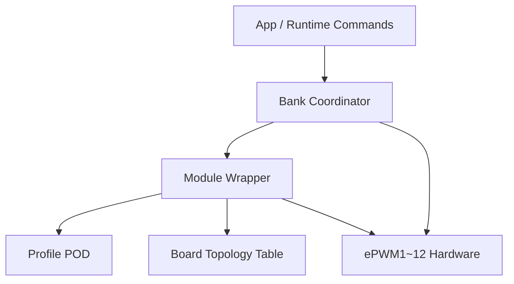
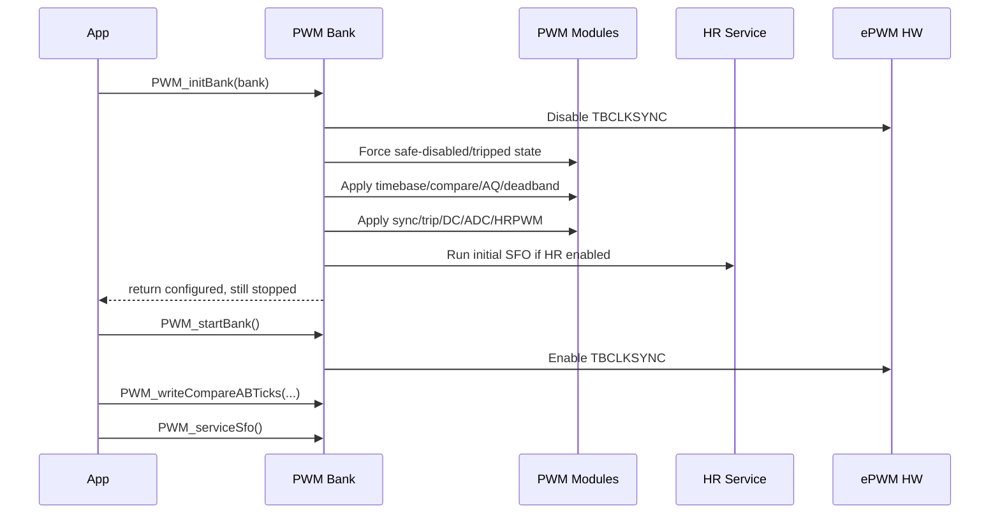
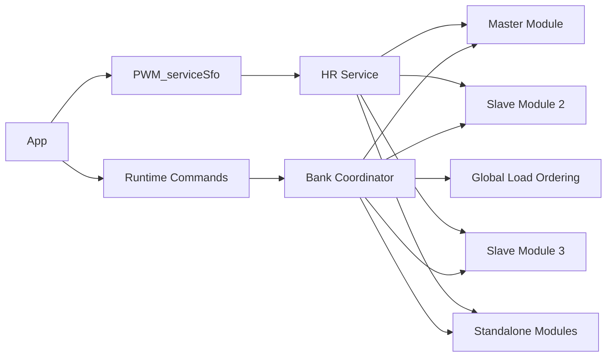

# CPU1 PWM Architecture for EPWM1-12

기준 자료: `docs/board/board-io-reference.md`, `CPU1/include_editable/pinmux.h`, `CPU1/device_not_editable/device.h`, `docs/ti/C2000ePWM가이드.pdf`

## 목적

- 이 문서는 CPU1에서 `EPWM1~12`를 다루기 위한 구조를 먼저 고정해 두기 위한 설계 문서다.
- 목표는 `12개 module x A/B 2출력 = 24 physical outputs`를 일관된 방식으로 다루는 것이다.
- 구현 대상은 이후 `CPU1/include_editable/pwm.h`와 `CPU1/source_editable/pwm.cpp`다.
- 이 단계에서는 구조와 인터페이스를 완성하고, 실제 제품용 파형 숫자값은 후속 board profile 단계에서 채운다.

## 전제와 제약

- 현재 보드 문서 기준으로 외부 제어 출력은 `EPWM1~12`가 CPU1 쪽에 매핑되어 있다고 가정한다.
- pinmux와 peripheral clock enable은 기존 `device`/`pinmux` 경로를 유지한다.
- PWM 레이어는 pinmux 자체를 다시 정의하지 않고, 이미 열린 하드웨어를 정책적으로 구성하는 역할만 맡는다.
- C28x C++03 정책을 그대로 따른다.
- 예외, RTTI, 동적 메모리, 가상 함수, 전역 생성자 기반 초기화는 사용하지 않는다.
- 하드웨어 side effect는 명시적 `init`, `apply`, `start`, `stop`, `trip`, `clear` 경로에만 둔다.
- 초기 기본 상태는 반드시 `safe-off`다.

## 사람들이 보통 어떻게 짰는가

### 1. Flat Init Functions

- 가장 흔한 첫 단계는 `InitEPwm1Example()`, `InitEPwm2Example()`처럼 module마다 함수 하나씩 두는 방식이다.
- 장점은 빠르고 디버그가 쉽다는 점이다.
- 단점은 module 수가 늘면 중복이 폭발하고, sync, deadband, trip, ADC trigger, HRPWM 같은 기능이 섞이면서 수정 비용이 급격히 커진다는 점이다.

### 2. Driverlib Helper 중심 구조

- TI 예제처럼 `EPWM_configureSignal()` 같은 helper를 쓰고, 필요한 부분만 별도 함수로 덧붙이는 방식이다.
- 장점은 driverlib idiom과 잘 맞고 예제 재사용이 쉽다는 점이다.
- 단점은 프로젝트 고유 정책이 helper 호출 순서에 숨어 버리고, 안전 정책과 board topology가 코드 전반에 흩어지기 쉽다는 점이다.

### 3. Table-Driven Wrapper 구조

- 실제 제품 코드에서는 `정적 profile table + 얇은 module wrapper + bank coordinator` 구조가 가장 오래 버틴다.
- board topology, 기능 profile, runtime command를 분리할 수 있고, C++를 써도 zero-overhead에 가깝게 유지할 수 있다.
- 이 문서는 세 번째 구조를 채택한다.

## 채택 구조 요약

- `Board topology layer`는 `EPWM1~12`의 물리 identity를 담당한다.
- `Profile layer`는 time-base, compare, AQ, deadband, sync, trip, digital compare, ADC trigger, HRPWM 설정을 POD로 담는다.
- `Module wrapper layer`는 단일 module에 대한 register write 순서와 검증을 담당한다.
- `Bank coordinator layer`는 `TBCLKSYNC`, sync 연결, global load ordering, SFO service를 담당한다.
- `App/runtime command layer`는 좁은 runtime API만 사용해 듀티, 주기, 위상, safe enable/disable, trip clear를 수행한다.



## Board Topology

- 외부 출력 기준 module은 `EPWM1~12`까지만 우선 다룬다.
- 각 module은 `A/B` 두 출력을 가진다.
- `A/B`는 항상 동등하지 않다.
- `independent` topology에서는 `A`와 `B`를 각각 직접 제어한다.
- `complementary` topology에서는 `A`를 기준 신호로 두고 `B`는 deadband 또는 inversion 정책에 의해 파생된다.
- runtime API는 이 차이를 반드시 드러내야 한다.
- profile 없는 기본 상태는 모든 module이 `safe-disabled`여야 한다.

| 항목 | 고정 값 |
| --- | --- |
| PWM bank | EPWM1 ~ EPWM12 |
| Physical outputs | EPWMxA, EPWMxB |
| 기본 ownership 가정 | CPU1 |
| pinmux source of truth | `CPU1/include_editable/pinmux.h` |
| 기본 출력 정책 | `safe-off first` |

## 추상화 레벨과 책임

| 레벨 | 책임 | 포함 항목 | 런타임 변경 |
| --- | --- | --- | --- |
| Board topology | module identity와 물리 base/pin mapping | base address, GPIO A/B, logical name | 아니오 |
| Profile | module이 어떤 PWM으로 동작할지 정의 | TB, CMP, AQ, DB, Sync, TZ, DC, ADC, HRPWM | profile 재적용 시만 |
| Module wrapper | 단일 module register write와 validation | apply 순서, clamp, assert, safe-fail | 예 |
| Bank coordinator | multi-module sequencing | TBCLKSYNC, sync topology, global load, SFO | 예 |
| App/runtime | 좁은 제어 명령 | duty, period, phase, enable, trip, clear | 예 |

## 공개 인터페이스

### 공개 타입

아래 타입은 C에서 직접 사용할 수 있는 POD로 유지한다.

| 타입 | 역할 |
| --- | --- |
| `PWM_ModuleId` | `EPWM1~12` 식별자 |
| `PWM_OutputTopology` | `independent`, `complementary active high`, `complementary active low` 구분 |
| `PWM_SyncRole` | `standalone`, `master`, `slave` 구분 |
| `PWM_TripAction` | trip 발생 시 출력 강제 상태 |
| `PWM_HrMode` | HRPWM을 `disabled`, `duty`, `period`, `phase` 중 무엇으로 쓸지 정의 |
| `PWM_SfoStatus` | `not active`, `updated`, `ok`, `error` 상태 전달 |
| `PWM_TimebaseConfig` | counter mode, prescaler, period, phase, shadow/load 정책 |
| `PWM_CompareConfig` | `CMPA`, `CMPB` 초기값과 shadow 정책 |
| `PWM_ActionQualifierConfig` | `A/B`의 action qualifier 동작 |
| `PWM_DeadbandConfig` | complementary/edge delay 관련 설정 |
| `PWM_SyncConfig` | sync in/out source, phase load 정책 |
| `PWM_TripZoneConfig` | one-shot, CBC, TZA/TZB safe action |
| `PWM_DigitalCompareConfig` | digital compare source, filter, blanking 정책 |
| `PWM_AdcTriggerConfig` | SOCA/SOCB source, prescale, enable |
| `PWM_HrConfig` | HRPWM edge mode, control mode, channel selection |
| `PWM_ModuleProfile` | module 단위 최종 profile |
| `PWM_BankProfile` | bank 전체 초기 profile 묶음 |

### 공개 함수

| 함수 | 역할 | 비고 |
| --- | --- | --- |
| `bool PWM_initBank(const PWM_BankProfile* bank);` | bank 전체 초기화 | `TBCLKSYNC off` 상태에서 profile 적용 |
| `void PWM_startBank(void);` | bank 시작 | `TBCLKSYNC on` |
| `void PWM_stopBank(void);` | bank 정지 | `TBCLKSYNC off` |
| `bool PWM_applyProfile(PWM_ModuleId module, const PWM_ModuleProfile* profile);` | 단일 module profile 재적용 | debug assert + release safe-fail |
| `bool PWM_writeCompareABTicks(PWM_ModuleId module, uint16_t cmpa, uint16_t cmpb);` | compare runtime update | topology-aware |
| `bool PWM_writePeriodTicks(PWM_ModuleId module, uint16_t tbprd);` | 주기 runtime update | 범위 검증 필요 |
| `bool PWM_writePhaseTicks(PWM_ModuleId module, uint16_t tbphs);` | 위상 runtime update | slave일 때만 의미 있음 |
| `void PWM_enableOutputs(PWM_ModuleId module);` | 안전하게 출력 활성 | trip clear가 선행 조건일 수 있음 |
| `void PWM_disableOutputsSafe(PWM_ModuleId module);` | 안전하게 출력 비활성 | force low 또는 trip 활용 |
| `void PWM_forceTrip(PWM_ModuleId module);` | 즉시 safe state 강제 | 보호 동작 |
| `bool PWM_clearTrip(PWM_ModuleId module);` | trip 해제 | fault 원인 제거 후 호출 |
| `PWM_SfoStatus PWM_serviceSfo(void);` | HRPWM SFO V8 보정 서비스 | background/main loop에서 호출 |

### 권장 헤더 스켈레톤

```cpp
#ifndef PWM_H_
#define PWM_H_

#include <stdbool.h>
#include <stdint.h>

#ifdef __cplusplus
extern "C" {
#endif

typedef enum
{
    PWM_MODULE_1 = 0,
    PWM_MODULE_2,
    PWM_MODULE_3,
    PWM_MODULE_4,
    PWM_MODULE_5,
    PWM_MODULE_6,
    PWM_MODULE_7,
    PWM_MODULE_8,
    PWM_MODULE_9,
    PWM_MODULE_10,
    PWM_MODULE_11,
    PWM_MODULE_12,
    PWM_MODULE_COUNT
} PWM_ModuleId;

bool PWM_initBank(const PWM_BankProfile* bank);
void PWM_startBank(void);
void PWM_stopBank(void);
bool PWM_applyProfile(PWM_ModuleId module, const PWM_ModuleProfile* profile);
bool PWM_writeCompareABTicks(PWM_ModuleId module, uint16_t cmpa, uint16_t cmpb);
bool PWM_writePeriodTicks(PWM_ModuleId module, uint16_t tbprd);
bool PWM_writePhaseTicks(PWM_ModuleId module, uint16_t tbphs);
void PWM_enableOutputs(PWM_ModuleId module);
void PWM_disableOutputsSafe(PWM_ModuleId module);
void PWM_forceTrip(PWM_ModuleId module);
bool PWM_clearTrip(PWM_ModuleId module);
PWM_SfoStatus PWM_serviceSfo(void);

#ifdef __cplusplus
}
#endif

#endif
```

## 내부 C++03 조직

내부 구현은 `namespace pwm` 아래에서만 C++ 기능을 쓴다. 외부에는 C ABI만 노출한다.

| 내부 구성요소 | 책임 |
| --- | --- |
| `ModuleTraits` | base address, GPIO A/B, logical name, module index |
| `ModuleState` | 마지막 적용 profile의 핵심 runtime 상태 캐시 |
| `Module` | 단일 module register write와 검증 |
| `Bank` | bank 전체 sequencing, start/stop, sync ordering |
| `HrService` | SFO V8 service와 HRPWM 활성 여부 관리 |

### 권장 구현 스켈레톤

```cpp
namespace pwm
{
    struct ModuleTraits
    {
        uint32_t base;
        uint16_t gpio_a;
        uint16_t gpio_b;
        const char* logical_name;
    };

    struct ModuleState
    {
        PWM_OutputTopology topology;
        uint16_t period_ticks;
        bool hr_enabled;
        bool configured;
    };

    class Module
    {
    public:
        explicit Module(PWM_ModuleId id);

        bool applyProfile(const PWM_ModuleProfile& profile);
        bool writeCompareAB(uint16_t cmpa, uint16_t cmpb);
        bool writePeriod(uint16_t tbprd);
        bool writePhase(uint16_t tbphs);
        void enableOutputs();
        void disableOutputsSafe();
        void forceTrip();
        bool clearTrip();

    private:
        bool applyTimebase(const PWM_TimebaseConfig& cfg);
        bool applyCompare(const PWM_CompareConfig& cfg);
        bool applyActionQualifier(const PWM_ActionQualifierConfig& cfg);
        bool applyDeadband(const PWM_DeadbandConfig& cfg);
        bool applySync(const PWM_SyncConfig& cfg);
        bool applyTripZone(const PWM_TripZoneConfig& cfg);
        bool applyDigitalCompare(const PWM_DigitalCompareConfig& cfg);
        bool applyAdcTrigger(const PWM_AdcTriggerConfig& cfg);
        bool applyHrPwm(const PWM_HrConfig& cfg);
    };
}
```

## 초기화와 시작 순서

- `PWM_initBank()`는 bank 전체를 구성하지만 시작시키지 않는다.
- start와 init을 분리하는 이유는 `TBCLKSYNC`, sync topology, global load, safe-off 정책을 한 번에 고정하기 위해서다.
- `TBCLKSYNC off` 상태에서 모든 register를 정리한 뒤, 마지막에만 `PWM_startBank()`로 구동을 시작한다.



## 런타임 규칙

### Topology-aware write

- `independent` topology에서는 `cmpa`와 `cmpb`를 둘 다 runtime으로 갱신할 수 있다.
- `complementary` topology에서는 `A`가 기준 신호다.
- complementary mode에서 `PWM_writeCompareABTicks()`로 `cmpb`를 별도로 밀어 넣으려 하면 규칙 위반으로 보고 `false`를 반환한다.

### Failure Policy

- debug build에서는 invalid range, incompatible topology, null profile, unsupported combination에 `ASSERT()`를 건다.
- release build에서는 같은 조건에서 `false`를 반환하고 해당 module을 `safe-disabled` 상태로 유지한다.
- release에서는 "조용히 이상한 파형을 내보내는 것"보다 "안전하게 멈추는 것"을 우선한다.

### Safe-Off First

- profile이 아직 적용되지 않은 module은 어떤 경우에도 출력 활성 상태가 되면 안 된다.
- `PWM_enableOutputs()`는 그 module이 유효 profile을 가진 경우에만 의미가 있다.
- fault나 invalid state 이후의 기본 복구 절차는 `원인 제거 -> clear trip -> enable outputs` 순서다.

## Sync, Global Load, HRPWM, SFO

- sync topology는 module profile의 일부로 둔다.
- 한 bank 안에는 standalone module과 master/slave module이 섞여도 된다.
- global load ordering은 `Bank`가 책임지고, 단일 module은 자신의 register programming만 담당한다.
- HRPWM은 같은 추상화 안에 포함하지만 SFO 없는 HRPWM은 허용하지 않는다.
- HRPWM profile이 활성화된 bank는 background 경로에서 `PWM_serviceSfo()`를 주기적으로 호출해야 한다.



## Bring-Up 순서

- `Device_init()` 호출
- `GPIO_setPinMuxConfig()` 호출
- bank profile 준비
- `PWM_initBank()` 호출
- scope 연결 전까지는 `PWM_startBank()`를 호출하지 않음
- `PWM_startBank()` 호출
- `PWM_writeCompareABTicks()` 또는 `PWM_writePeriodTicks()`로 runtime 변화 확인
- `PWM_forceTrip()`와 `PWM_clearTrip()`로 보호 동작 확인
- HRPWM 사용 시 `PWM_serviceSfo()` 주기 호출 확인

## Scope 확인 포인트

- independent profile에서 `EPWM1A/B`가 기대한 `TBPRD/CMPA/CMPB`를 반영하는지 확인한다.
- complementary profile에서 `EPWM2A/B`가 deadband를 유지한 보완 파형인지 확인한다.
- sync profile에서 `EPWM1` master와 `EPWM2/3` slave의 위상차가 기대한 ticks만큼 맞는지 확인한다.
- trip/digital compare profile에서 fault 후 출력이 safe state로 가는지 확인한다.
- ADC trigger profile에서 SOCA/SOCB timing이 선택한 counter event에 맞는지 확인한다.
- HRPWM profile에서 coarse-only보다 미세한 edge 이동이 가능한지 확인한다.

## 이번 단계의 범위 밖

- 실제 제품용 12개 채널의 최종 주파수, 듀티, 위상 숫자값
- `main_cpu1.c` 변경
- pinmux 재정의
- CPU2나 CM으로 ownership을 재분배하는 작업

## 결론

- 이 프로젝트의 PWM 구조는 `module별 flat init 함수`보다 `정적 profile table + zero-overhead wrapper + bank coordinator`가 맞다.
- 이렇게 두면 `EPWM1~12`의 공통성과 차이를 동시에 관리할 수 있다.
- 이후 구현은 이 문서를 기준으로 `pwm.h`에는 C ABI와 POD 타입만, `pwm.cpp`에는 C++03 내부 계층만 넣는 방식으로 진행하면 된다.
