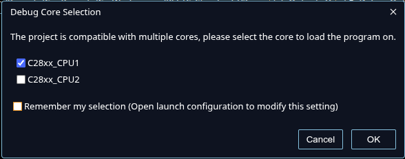

# Sung TODO - 0427 Today

이 파일은 0427 오늘 진행할 TODO다. 사람이 직접 체크한다. 에이전트는 이 파일을 수정하지 않는다.

- [x] Obsidian 설치 및 저장소를 vault로 열기
- [x] VS Code 설치 및 저장소 열기
- [x] Codex Windows 앱 또는 VS Code 확장 중 편한 방식으로 설치 및 로그인 확인
- [x] Git 설치 및 기본 설정
- [x] GitHub 계정 생성
- [x] GitHub에서 저장소 fork하기
- [x] fork한 저장소 clone하기
- [x] 자신의 dev 브랜치 생성
- [x] CCS 환경 세팅
- [x] CCS에서 프로젝트 빌드 성공시키기
- [x] JTAG(USB)으로 보드 연결 및 부팅 성공시키기
- [x] 자신의 dev 브랜치에 commit/push 하기

## JTAG(USB) 디버그 연결 기준

아직은 CPU 하나만 켜는 단계다. 매번 디버그를 시작할 때 아래 창이 뜨면 `C28XX_CPU1`만 선택하고 `OK`를 누른다.

# Sung TODO - 0428 Today

## CM 통신 살려서 오실로스코프로 확인하기

- [ ] `CPU1 -> CM` 핸드셰이크가 성공하는지 먼저 확인하기
- [ ] CM UART 핀 기준 확인하기: `UARTA_TX GPIO84`, `UARTA_RX GPIO85`
- [ ] CM에서 UART TX만 먼저 출력하게 만들기
- [ ] 오실로스코프로 `GPIO84` TX 파형 확인하기
- [ ] UART baud rate가 설정값과 맞는지 오실로스코프 time scale로 확인하기
- [ ] 가능하면 UART loopback 또는 PC serial 수신까지 확인하기
- [ ] 성공 조건 기록하기: CM ACK 유지, UART TX 파형 관측, CPU1 heartbeat 유지

## CPU2 살리기

- [ ] `CPU1` 단독 부팅과 heartbeat가 유지되는지 먼저 확인하기
- [ ] `CPU1`에서 `CPU2` boot/release 호출 지점 확인하기
- [ ] `CPU2`가 `main()`에 진입했는지 debugger 변수로 확인하기
- [ ] `CPU1 <-> CPU2` MSGRAM token 왕복 경로 만들기
- [ ] CPU2 heartbeat 또는 timer tick counter 관측하기
- [ ] CPU1, CPU2, CM 세 코어를 동시에 debug attach 해서 상태 확인하기
- [ ] 성공 조건 기록하기: CPU2 main 진입, token ACK 관측, CPU1 heartbeat 유지

## Altium 계정 만들기
- [ ] 서울시립대 uos.ac.kr 이메일로 계정 만들기
- [ ] 워크스페이스 찬희 박 신청하기 << 이번 주